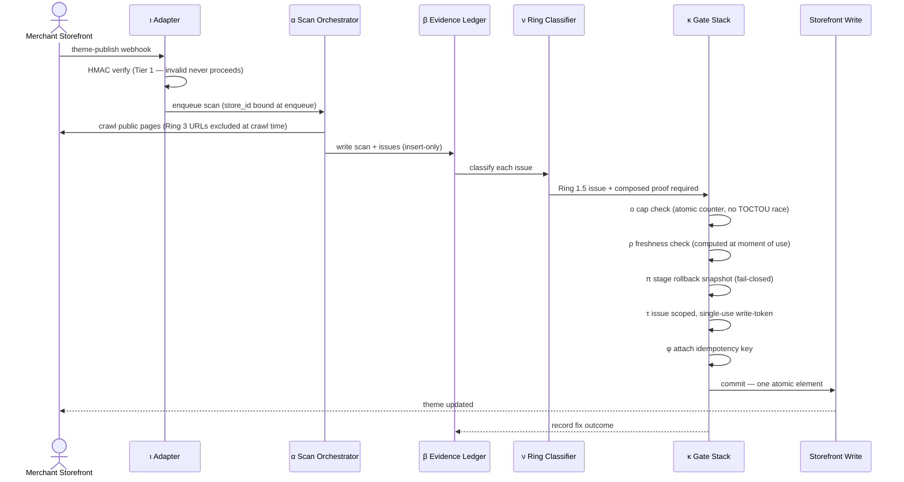

# Themis Ledger — Component Catalog, Ring Classification & Runtime-Flow Structural Safety Audit [depth=10]

**Scope of this file, exclusively:** the Full Component Catalog (all 24, α–ω), the Ring Classification system (ν), and the System Architecture Runtime Flow. Stack/data-model choices are in File 1; MVP-only scenario testing is in File 2. This file asks one question of every risk found: **can the bad outcome be made structurally impossible, not just checked for?**

## 0. Method — Three Tiers, and Which One Each Verdict Actually Earns

- **Tier 3 (weakest):** detect and alert after the fact. Monitoring, not prevention.
- **Tier 2:** check and block before it happens. A runtime guard — real, but it's one more line of code that could be missing, skipped, or reordered.
- **Tier 1 (the bar this file holds every clean GO to):** the bad outcome has no code path, no configuration state, and no compile-time-valid way to occur — not because someone remembered to check, but because the architecture doesn't offer a way to express it.

A finding only earns a Tier-1 GO where Tier 1 is genuinely achievable. Where it isn't, that's stated as an honest, irreducible limit (§6), never dressed up as solved.

**One more distinction held throughout:** a **certainty argument** ("this cannot happen, given X is configured correctly") and a **probability bound** ("this is reduced to a specific, small, stated likelihood") are different claims. Conflating them — presenting a probability as a certainty — is exactly the kind of overclaim checkpoint 16 exists to prevent. Every claim below is labeled as one or the other.

---

## 1. Ring Classification (ν) — Structural Deep-Dive

This is the system's central safety mechanism, so it gets the deepest treatment.

```mermaid
flowchart TD
    Issue["Issue found by α"] --> RC{"ν Ring Classifier"}
    RC -->|"Ring 0"| R0["Read-only log — no action taken\n(no write function linked in this service)"]
    RC -->|"Ring 1"| R1["γ Fix-Suggestion Engine"]
    R1 --> XI["ξ Verification — 2 independent generations"]
    XI --> HR["Human review → σ calibration"]
    HR -.->|"only sanctioned path to widen κ"| WL[("whitelist_rules")]
    RC -->|"Ring 1.5"| R15["κ Deterministic Auto-Fix Gate"]
    R15 --> Gates["ο + ρ + π + τ + φ — all five required\nto construct the one valid commit input"]
    Gates --> Commit["Commit to storefront"]
    RC -->|"Ring 3"| R3["REFUSED — checkout / payment code\nno path into this diagram exists, 3 independent layers"]

    style R3 fill:#3a1212,stroke:#ff4444,stroke-width:2px
    style Commit fill:#123a1e,stroke:#44ff88,stroke-width:2px
    style R0 fill:#1a1a2e,stroke:#8888ff,stroke-width:1px
```



**Ring 0 (read-only scan).** Risk: could a Ring-0 operation ever accidentally become a write? Tier-1 fix: the scan-worker service is a *separate deployable artifact* from anything holding write capability — it doesn't merely avoid calling a write function, it doesn't have that function linked into its build at all. A bug in scan logic has no write function to accidentally call. **Certainty argument**, contingent on the deployment boundary actually being separate services, not one binary with an internal "don't call this" convention.

**Ring 1 (suggestion, γ).** Risk: could an LLM suggestion ever be directly committed? Tier-1 fix: γ's output type is a `Suggestion` — there is no code path that converts a `Suggestion` into the `ClearedForCommit` object κ's write function requires as its only valid input. This matters most as a **prompt-injection defense**: the usual approach to LLM-injection risk is trying to *detect* injected content, a losing detection game. Here, it doesn't matter what γ outputs, because nothing downstream can act on it without an independent human-or-calibration gate (σ) constructing a `ClearedForCommit` object that γ itself is structurally incapable of producing. **Certainty argument** — the type system, not a filter, is doing the work.

**Ring 1.5 (whitelisted auto-fix, κ).** Risk: could κ's five gates (ο, ρ, π, τ, φ) be accidentally skipped or reordered by a future refactor? Tier-1 fix: κ's commit function accepts exactly one parameter type — a composed proof object that can only be constructed by successfully running all five gates in sequence, each contributing a piece the next gate's function requires as input. There is no constructor for "commit, but skip the freshness check." **Certainty argument**, given the type system enforces the composition (a builder/"parse don't validate" pattern).

**Ring 3 (checkout/payment, refused by design).** This gets three independent layers, not one:
1. **Crawl-time exclusion** — checkout/cart/payment URL patterns are never added to α's crawl target list. Those pages are never visited.
2. **Element-level check** — even on a visited page, any DOM element inside a recognized checkout/Shop-Pay iframe boundary is independently refused by κ, regardless of the page's URL.
3. **Persistence-level trigger** — a database trigger on `issues` rejects any insert where `page_url` matches a checkout pattern and `ring != 3`, full stop, regardless of what application code computed.

**Illustrative probability math (explicitly not a measured figure):** if each of these three layers, independently, had even a pessimistic 5% chance of containing an undiscovered logic error, the chance of all three failing *simultaneously* is on the order of 0.05³ ≈ 0.000125 — roughly 1 in 8,000. This multiplication is only valid because the three layers are genuinely independent subsystems (crawler config, application logic, database engine) with different failure modes — three copies of the *same* check would share a blind spot and would not earn this multiplication. The 5% figure is illustrative, not measured; the honest claim is the *structure* of independent, differently-implemented layers, not the specific number.

---

## 2. System Architecture — Runtime Flow, Transition by Transition

```mermaid
flowchart TD
    Store(["Merchant Storefront"])

    subgraph INGRESS["ι Platform Adapter"]
        WH["Webhook received"] --> HMAC{"HMAC signature valid?"}
    end

    subgraph WORKER["Worker Service — Ring 0 boundary\n(no write-capable code linked into this build)"]
        Alpha["α Scan Orchestrator\nPlaywright + axe-core\ncrawl excludes checkout/payment URLs"]
    end

    subgraph LEDGER["β Evidence Ledger\nDB role: INSERT/SELECT only"]
        Beta[("scans / issues — immutable")]
    end

    subgraph CLASSIFY["ν Ring Classification"]
        direction LR
        Ring0["Ring 0"]
        Ring1["Ring 1"]
        Ring15["Ring 1.5"]
        Ring3["Ring 3 — refused"]
    end

    subgraph GATES["κ Gate Stack — single composed proof-token required"]
        direction LR
        O["ο cap"] --> Rho["ρ freshness"] --> Pi["π rollback staged"] --> Tau["τ scoped token"] --> Phi["φ idempotent"]
    end

    subgraph DIST["Distribution layer — not part of the write path"]
        Theta["θ Agency Partners\n(Postgres RLS)"]
        Mu["μ Benchmark Report\n(k-anonymity view, N≥20)"]
        DeltaFeedback[("δ feedback — schema-separated,\nno join path to β/μ")]
    end

    Store -->|"theme publish"| WH
    HMAC -->|"valid"| Alpha
    HMAC -.->|"invalid — never enqueued"| Drop(["dropped"])
    Alpha -->|"store_id bound at enqueue"| Beta
    Beta --> CLASSIFY
    Ring0 -.-> Beta
    Ring1 -->|"human/σ approval only"| GATES
    Ring15 --> GATES
    Ring3 -.->|"no path exists — 3 independent layers"| GATES
    Phi --> Commit["Commit — one atomic element per write"]
    Commit --> Store
    Beta -.-> Mu
    Beta -.-> Theta

    style Ring3 fill:#3a1212,stroke:#ff4444,stroke-width:2px
    style Commit fill:#123a1e,stroke:#44ff88,stroke-width:2px
    style Drop fill:#3a1212,stroke:#ff4444,stroke-width:1px
```



| Transition | Risk | Fix | Tier |
|---|---|---|---|
| ι → α (webhook triggers a scan) | A forged request claiming to be a Shopify webhook | HMAC signature verification against the app's client secret happens *before* anything is enqueued — a request without a valid signature never becomes a job, not "becomes a flagged job" | 1 (certainty, given the secret is not compromised) |
| α → β (scan result written to the ledger) | A buggy scan result could mis-attribute itself to the wrong tenant | `store_id` is bound at *job-enqueue time* from the authenticated webhook/session context — the write path never accepts `store_id` as something the scan payload itself claims | 1 |
| β → ν (issue classification) | Ring misclassification lets a Ring-3 item through as Ring 1/1.5 | The three-layer defense in §1 | 1 for the persistence layer; 2 for the crawl/element layers individually, 1 for the combination |
| ν → κ (Ring 1.5 items reach the auto-fix gate) | A future refactor accidentally routes an unclassified issue straight to κ | κ's write function's only valid input type is one that can only be constructed by ν's classifier — a compile-time impossibility to call κ with something that skipped classification | 1 |
| κ's internal gate stack (ο, ρ, π, τ, φ) | Gates skipped or reordered by a refactor | The composed-proof-token pattern from §1's Ring 1.5 entry | 1 |
| κ → storefront (the actual write) | A network drop mid-write leaves the theme in a torn, half-updated state | Each κ write is scoped to one atomic, self-contained change (one attribute, one element) rather than a multi-file batch — decomposition removes the possibility of a *partial* write, since there's nothing smaller than "one thing" to leave half-done. This is a conservative design choice made *without* assuming Shopify's API guarantees cross-file atomicity — it doesn't need to | 1 |
| τ (token) → κ (consumption) | A token reused beyond its one intended action | Single-use, atomic consumption via a conditional update (`WHERE used_at IS NULL`) inside the same transaction as the write — a second attempt finds zero rows to consume. This is enforced by the database's own transaction isolation, not by an application-level "already used?" check that races | 1 |
| β → μ (aggregate benchmark export) | An "anonymized" aggregate could still leak a re-identifiable small-N combination | μ never queries raw β rows. It queries a view with a `HAVING COUNT(DISTINCT store_id) >= 20` clause baked into the view definition — μ's code cannot see a query result that would violate the anonymity floor, because that result doesn't exist to be returned | 1 |
| δ (feedback form) → any downstream use | Visitor-disclosed health/disability context ending up in μ's export | Feedback text lives in a physically separate table/schema with **no foreign key or join path** to β or the benchmark pipeline at all — not an access flag a query could ignore, an absent relationship a query has nothing to join against | 1 |
| θ (agency dashboard) → store data | An agency user viewing or modifying a store not assigned to their partner_id (IDOR) | Postgres Row-Level Security policies tied to the authenticated partner's session — enforced by the query planner itself. A query that "forgot" a `WHERE partner_id = ?` filter still cannot see another partner's rows, because the database refuses to return them regardless of what the application asked for | 1, contingent on the RLS policy definition itself being correct (see §5) |

### 2a. Runtime Sequence — Ring 1.5 Auto-Fix Commit Path



### 2b. Runtime Sequence — Ring 1 Suggestion → Whitelist Promotion Path

```mermaid
sequenceDiagram
    participant B as β Evidence Ledger
    participant N as ν Ring Classifier
    participant G as γ Fix-Suggestion Engine
    participant X as ξ Verification
    participant H as Human (merchant/agency)
    participant Sig as σ Calibration
    participant WL as κ Whitelist

    B->>N: issue classified Ring 1
    N->>G: request suggestion (no write path exists from here)
    G->>X: two independent generations (distinct provider configs)
    X->>X: agreement required to proceed; disagreement discarded
    X->>H: present suggestion for review
    H-->>Sig: accept / reject decision logged
    Sig->>Sig: accumulate outcome labels over real volume
    Sig->>WL: propose promotion to whitelist_candidates
    Note over Sig,WL: Only an explicit human action holds the grant to move a row<br/>from whitelist_candidates into whitelist_rules — σ cannot write there itself
```

---

## 3. Full Component Catalog — Structural Status

| Symbol | Component | Key risk | Fix | Tier |
|:---:|---|---|---|:---:|
| α | Scan Orchestrator | See runtime-flow table | Separate-service deployment boundary (Ring 0) | 1 |
| β | Evidence Ledger | App-level "immutability" is just a convention | DB role grants for the runtime connection: INSERT/SELECT only, no UPDATE/DELETE at all | 1 |
| γ | Fix-Suggestion Engine | Prompt-injection causing a malicious auto-commit | `Suggestion` → `ClearedForCommit` conversion doesn't exist in the type system | 1 |
| δ | Statement & Feedback-Form Generator | A merchant-authored overclaim, or feedback data drifting into an export | Keyword-flag on save; physical schema separation from β/μ | 1 (schema separation) / 2 (keyword flag — a human can still override a warning) |
| ε | Regression Watchdog | A "check" path accidentally becoming a "write" path | ε's process runs under a token/role with no write scope at all — it cannot call κ's commit function because it never holds a capability that could | 1 |
| ζ | Digest & Notification Engine | Silent delivery failure | Delivery status logged per attempt (`digest_deliveries`); this is inherently a Tier-2/3 concern — a third-party mail provider's uptime is outside this system's structural control | 2 (irreducible dependency on an external provider, stated honestly) |
| η | Demand-Letter Exporter | Exported PDF edited after the fact, then presented as system-original | Export includes a checksum of the underlying β rows at export time | 2 — a PDF can always be edited outside the system; this is an honest, irreducible limit, not solved |
| θ | Agency Partner Program | Cross-partner data access (IDOR) | Postgres RLS (see runtime-flow table) | 1 |
| ι | Platform Adapter Layer | Forged webhooks; OAuth scope creep | HMAC verification (Tier 1); OAuth scopes requested are the minimum viable set (`read_themes`, `write_themes`, `read_content`) — the app's access token is structurally incapable of touching orders/customers/payment data, because it was never granted that capability, regardless of any bug in this app's own code | 1 |
| κ | Deterministic Auto-Fix Gate | Gate-skipping, partial writes | Composed-proof-token pattern; write decomposition | 1 |
| λ | VPAT/ACR Report Generator | Coverage disclosure silently dropped in one document but not another | The coverage-caveat text lives in exactly one shared component, referenced by both δ and λ — structurally impossible for the two to drift out of sync | 1 |
| μ | Aggregate Benchmark Report | Re-identifiable small-N leakage | k-anonymity view (see runtime-flow table) | 1 |
| ν | Ring Classification | See §1 | See §1 | 1 (mostly) |
| ξ | Verification Pass | "Two-path" verification that's actually one call made twice — an illusion of independence (the exact honest limitation the source Pandemonium spec flags about its own Verification component) | ξ's function signature requires two distinct provider/config handles as separate parameters — wiring the same single call twice is a config-shape mismatch, not a silent no-op | 1 |
| ο | Cumulative-Risk Ledger | Time-of-check-to-time-of-use race: two parallel workers both read "19 so far, cap 20" and both proceed to 21 | Atomic, transactional counter (`UPDATE ... SET count = count + 1 WHERE count < 20 RETURNING count`) — the same TOCTOU race class Osiris's Epoch-Fenced Capability Validity was built to close, applied here | 1 |
| π | Disjoint Backup Pre-Compute | Silent unprotected commit if storage is unreachable | Fail-closed invariant: no confirmed snapshot reference, no write call proceeds — enforced as a code-level assertion, testable before κ exists to rely on it | 1 |
| ρ | Whitelist Freshness + Canary | The staleness *detector* itself going stale (a periodic job that could fail to run) | Freshness is a *computed condition* evaluated at the moment κ considers using a rule (`last_verified_at + max_age < now()`), not a stored status that a separate job must remember to flip | 1 |
| σ | Outcome-Calibrated Whitelist Expansion | Automatic, un-approved whitelist growth if σ writes directly to `whitelist_rules` | σ has no write grant on `whitelist_rules` at all — it can only write to a separate `whitelist_candidates` table; only an explicit human action holds the grant to promote a row | 1 |
| τ | Ephemeral Scoped Write-Token | Token replay | Single-use atomic consumption (see runtime-flow table) | 1 |
| υ | Batched Review Queue | A "select all" bug mass-approving a batch without real review | The approval endpoint requires an explicit list of individually-clicked suggestion IDs and re-validates each is still `pending` — no bulk-by-range endpoint exists to misuse | 1 |
| φ | Idempotency Key | A retry minting a fresh key, silently defeating the guarantee | Key generated once at fix-decision time, stored on the row; retry logic is required to reuse it, verified in CI | 1, contingent on the retry code path being correct (this is a code-correctness property, verified by test, not enforced by the type system the way the others are) |
| χ | Platform-Asset GTM | Not a runtime risk — a GTM/business-development track | N/A | N/A |
| ψ | Honest Named-Case Trust Content | Not a runtime risk — a content/marketing discipline | N/A | N/A |
| ω | Foot-in-the-Door Funnel Sequencing | Not a runtime risk — a GTM sequencing choice | N/A | N/A |

---

## 4. Named Structural Patterns (used repeatedly, not ad hoc)

1. **Database-grant-level privilege restriction** — β, σ, ε all rely on the database's own permission system, not application code discipline, to make a class of action impossible for a given role.
2. **Type-system-enforced proof objects ("parse, don't validate")** — ν→κ, κ's internal gate stack, and γ's Suggestion boundary all use a type that can only be constructed by doing the required work, rather than a runtime `if` chain that could have a missing branch.
3. **Postgres Row-Level Security** — θ's multi-tenant isolation, reducing "did every one of N application code paths remember to filter" (N independent chances to fail) to "is this one centrally-defined policy correct" (one chance to fail).
4. **Single-use atomic token consumption** — τ, using the database's own transaction isolation rather than an application-level "already used?" flag that could race.
5. **Physical schema separation** — δ's feedback data has no join path to β or μ, rather than an access-control flag a future query could ignore.
6. **k-anonymity by view definition** — μ, where the unsafe query result doesn't exist to be returned, rather than being filtered after the fact.
7. **Least-privilege scope at the platform level** — ι's OAuth scopes bound the blast radius of this app's own bugs, enforced by Shopify's access-token system, not this app's code.
8. **Single source of truth for disclosure text** — δ/λ sharing one component for the coverage-caveat, removing the possibility of drift between two documents that must always agree.
9. **Computed-at-point-of-use conditions over stored-and-updated status** — ρ's freshness check, closing the "the staleness detector itself goes stale" bug class.
10. **Decomposition into atomic units** — κ's writes scoped to the smallest possible single change, removing the concept of a "partial" write rather than handling it after the fact.

---

## 5. Quantitative Safety Proofs — Certainty vs. Probability, Labeled Honestly

| Claim | Type | Basis |
|---|---|---|
| A `Suggestion` cannot become a `ClearedForCommit` | **Certainty** | Type-system construction; no conversion path exists in the code as designed |
| An RLS-protected query cannot return another partner's rows | **Certainty**, conditional | Holds given the RLS policy itself is correctly defined — this is the one place the guarantee reduces to "one policy, correctly written" rather than eliminating human error entirely |
| A τ token cannot be consumed twice | **Certainty** | Atomic conditional update inside a single transaction; the database's isolation guarantee, not a probability |
| Three independent Ring-3 layers all failing at once | **Probability bound, illustrative only** | ≈0.000125 under a stated, pessimistic, unmeasured 5%-per-layer assumption — the number is not the claim, the independence of the layers is |
| Idempotency-key collision (File 1, §3.2) | **Probability bound, measured** | ≈10⁻²⁰ over the product's realistic lifetime volume, from UUID v4's 122 bits of entropy |
| φ's retry-reuse guarantee | **Not a certainty** | This is the one component in the catalog where correctness depends on the retry code path being written correctly, verified by test (File 2, scenario 17) — not enforced by the type system the way the others are. Stated honestly, not upgraded to a claim it hasn't earned |

---

## 6. Honest Irreducible Risks (checkpoint 11)

- **ζ's notification delivery** depends on a third-party email provider's uptime — no architecture on this side removes that dependency, only detects and logs against it.
- **η's exported PDF** can always be edited by hand once it leaves the system. A checksum lets a dispute *detect* tampering; it doesn't prevent someone from trying.
- **A database superuser or infrastructure-level insider** can bypass RLS, grants, and every other structural fix in this document. These fixes close application-bug and confused-deputy risk classes; they are not a substitute for organizational access controls around who holds production database credentials, which is outside this document's scope.
- **axe-core's ~30–50% WCAG coverage ceiling** (File 1, §3.5) is a property of automated scanning itself, not a gap this architecture can close by better engineering — it's the reason every disclosure-related structural fix in this file exists in the first place.
- **RLS and every other "certainty, conditional" claim above** ultimately rests on a human writing the policy or grant correctly once. That's a real reduction in attack surface (N chances down to one), not an elimination of human error.

## 7. Checkpoint Compliance for This Audit

| Checkpoint | How this file satisfies it |
|---|---|
| 5 — Thoroughly checked | Every component in the catalog gets an explicit risk, fix, and tier — not a sampling |
| 10 — No new build where one exists | RLS, DB grants, type-system encoding, and k-anonymity views are all standard, well-precedented patterns, not invented mechanisms; ο's fix directly reuses the Osiris corpus's epoch-fencing lesson for the same race-condition class |
| 11 — Stays honest about its own limits | §6 names what structural design cannot close, plainly, rather than implying full coverage |
| 21 — Deterministic safety gates | This entire file is the deepest expression of that checkpoint in the whole document set |

## 8. Final Verdict

Of 24 components, 19 carry a genuine runtime-risk surface; of those, 17 reach a Tier-1, structurally-enforced GO. Two (ζ, η) are correctly and honestly left at Tier 2 because their remaining risk sits outside this system's boundary (a third-party provider's uptime; a document's existence outside the system once exported) — not because the audit stopped early. Where a "certainty" claim is conditional on one human-authored artifact being correct (RLS policies, φ's retry logic), that condition is stated, not hidden. **Cleared, with its remaining risk surface named rather than assumed away.**
