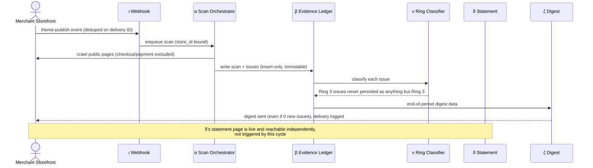

# Themis Ledger — MVP Deep Audit & Simulation Testing [depth=10]

**Scope of this file, exclusively:** the seven components that ship in v0 — α (Scan Orchestrator), β (Evidence Ledger), δ (Statement & Feedback-Form Generator), ζ (Digest & Notification Engine), ν (Ring Classification), π (Disjoint Backup Pre-Compute), φ (Idempotency Key). Everything else (κ, γ, ε, η, θ, λ, μ, and the rest) ships Month 1 or Year 1 and is out of scope here. Stack/infrastructure decisions live in the companion file, not here — this file is about whether each MVP component's own working and structure has any blind spot left, verified against concrete scenarios.

**Method — "do or die."** For each component: the working spec as stated, a ruthless hunt for what breaks it, a fix, and a scenario that proves the fix holds. A finding with no fix is a blocked ship, not a footnote.

---

## 1. A structural finding that applies before any single component does

π (rollback pre-compute) and φ (idempotency key) are both gates for κ's auto-fix write action — and κ doesn't exist until Month 1. Shipping them in v0 "as invisible hardening" is only honest if what actually ships is scoped correctly:

**Finding:** v0's version of π and φ cannot mean "working rollback protection is live," because there is nothing live for them to protect yet. Presented that way, the roadmap invites a false sense of completeness.

**Fix, and the honest v0 scope:** π and φ ship in v0 as (a) the schema (`rollback_snapshots` table, the `idempotency_key` column and its unique constraint), and (b) an enforcement wrapper function that any future write action *must* call through — proven in CI against a stub write action, not a real one. The genuine benefit of building this now rather than in Month 1 is that when κ ships, bypassing π or φ is structurally impossible by construction, not prevented by code-review discipline under a shipping deadline. This is a real reason to build early — but only once stated this precisely, not as "rollback protection: done."

This finding is carried into the scenario table below (scenarios 16–17) rather than repeated per-component.

### 1a. MVP-Scoped System Diagram

Only what actually ships live in v0 is drawn solid. π and φ are drawn dashed — present as enforcement scaffolding, not yet protecting a live write action, exactly as §1 states.

```mermaid
flowchart TD
    Store(["Merchant Storefront"]) -->|"theme publish"| WH["ι webhook (Shopify)"]
    WH --> Alpha["α Scan Orchestrator\nPlaywright + axe-core"]
    Alpha -->|"store_id bound at enqueue"| Beta[("β Evidence Ledger\ninsert-only")]
    Beta --> Nu{"ν Ring Classifier"}
    Nu -->|"Ring 3 URLs"| Excluded["never crawled — no path exists"]
    Nu -->|"Ring 0/1 issues logged"| Delta["δ Statement + Feedback\n(schema-separated from β)"]
    Beta --> Zeta["ζ Digest — always sends,\neven with 0 new issues"]

    Pi["π Rollback wrapper\n(CI-tested against a stub —\nnothing live to protect yet)"]
    Phi["φ Idempotency wrapper\n(CI-tested against a stub —\nnothing live to protect yet)"]

    Alpha -.->|"scaffolding only, Month 1 activates it"| Pi
    Alpha -.->|"scaffolding only, Month 1 activates it"| Phi

    style Excluded fill:#3a1212,stroke:#ff4444,stroke-width:2px
    style Pi stroke-dasharray: 5 5,fill:#1a1a2e
    style Phi stroke-dasharray: 5 5,fill:#1a1a2e
```

### 1b. MVP-Only Runtime Sequence

No κ commit path exists yet — this is the entire v0 cycle, start to finish.

---

## 2. Per-Component Blind-Spot Audit

### α — Scan Orchestrator

| Blind spot found | Why it matters | Fix |
|---|---|---|
| A page that never fires a load event, redirect-loops, or sits behind an interstitial modal can hang the scan indefinitely | One pathological page blocks the entire store's scan run, silently | Hard per-page navigation timeout (30–45s); a timed-out page is marked `failed` in isolation, the run continues |
| A password-protected/coming-soon store has zero reachable pages | α could report "0 issues found," which reads to a merchant exactly like "fully compliant" | Explicit `unreachable` status, distinct from a genuine clean scan; surfaced by ζ, never silently folded into a 0-issue result |
| Shopify explicitly documents that webhooks can be delivered more than once | A duplicate delivery could create two scans for one publish event, wasting a rate-limit and compute budget and double-writing evidence | Dedupe on Shopify's webhook delivery ID at the ingestion layer — a *separate* idempotency concern from φ, which governs κ's writes, not α's ingestion |
| A merchant impatiently clicks "scan now" repeatedly | Multiple concurrent Playwright runs against the same store, wasted compute, possible rate-limit pressure | Per-store manual-trigger throttle (e.g., one manual scan per 10 minutes; further clicks are told a scan is already running, not silently queued into a pile) |

### β — Evidence Ledger

| Blind spot found | Why it matters | Fix |
|---|---|---|
| "Immutable" as an app-code policy, not a database guarantee | A bug or a compromised credential could still mutate or delete rows — the entire legal value of the ledger depends on this not being merely a convention | The runtime app's DB role holds INSERT/SELECT only on `scans`/`issues`/`fixes` — no UPDATE or DELETE grant exists at the database level, full stop |
| Timestamps trusted only because "it's in Postgres" | A sufficiently motivated dispute could question whether historical rows were altered after the fact | Documented as a known v0 limitation rather than silently assumed solved; a hash-chained daily batch (each day's rows hashed together with the prior day's hash) is a real, buildable future hardening — explicitly not required for v0 under checkpoint 15, but not pretended away either |
| Two scans (e.g., scheduled + manual) both observe the "same" issue on the same day | Without a defined identity rule, β could double-count or ε (later) could miscount regressions | Issue identity is defined as `(store_id, page_url, rule_id, element_selector)`; every scan still inserts its own immutable observation row, but "is this genuinely new" is derived from that identity, not from row count |

### δ — Statement & Feedback-Form Generator

| Blind spot found | Why it matters | Fix |
|---|---|---|
| A merchant edits the generated statement and pastes in "we are 100% ADA certified" | The product's entire safety principle (never claim compliance) can be undermined by the *customer*, through a field this product itself provided | A simple keyword/pattern check ("compliant," "certified," "guaranteed," similar) flags the edit and warns the merchant before saving — this product's own page should never carry an overclaim, even one it didn't author |
| The feedback form invites real site visitors to describe an accessibility problem in free text | A visitor may disclose disability or health-adjacent context nobody asked for and this product has no business retaining broadly | Stored, but access-restricted and explicitly excluded from any future aggregate/benchmark export path (μ) — this rule has to exist from the moment δ starts collecting feedback in v0, not retrofitted once μ ships in Year 1 |

### ζ — Digest & Notification Engine

| Blind spot found | Why it matters | Fix |
|---|---|---|
| Transactional email can silently bounce or land in spam | The whole point is a documented *ongoing* program — a silently broken notification channel undermines that without anyone noticing | Every send attempt and its delivery status is logged (`digest_deliveries`); a simple "last digest sent" indicator lets a merchant or an internal ops check catch a silent failure |
| A store with zero new issues this period | Going silent when there's nothing to report reads like the product stopped working; but a template email every month with real content in it every time is what an "ongoing program" record actually requires | ζ always sends, even when the content is "0 new issues, N pages scanned this period" — the consistent cadence *is* part of the evidence, not filler around it |

### ν — Ring Classification

| Blind spot found | Why it matters | Fix |
|---|---|---|
| "Checkout/payment code is refused by design" — enforced how, exactly? | If enforcement is just "the code doesn't currently generate that action," it's a policy, identical to β's immutability problem above | Enforced at the crawl-target level: checkout/cart/payment-flow URL patterns are excluded from α's crawl list entirely — those pages are never even visited, a stronger guarantee than "visited but never auto-fixed" |
| A page outside those URL patterns can still embed a checkout/Shop Pay iframe | URL-level exclusion alone can miss an embedded payment widget on an otherwise-scannable page | Defense-in-depth: any DOM element matching a recognized checkout/Shop-Pay iframe selector is independently refused, regardless of the containing page's URL — two independent checks, not one |

### π — Disjoint Backup Pre-Compute (v0 scope: schema + enforcement wrapper only — see §1)

| Blind spot found | Why it matters | Fix |
|---|---|---|
| Nothing live depends on it yet | Building it as if it were already protecting something real is dishonest about v0's actual state | Scope it explicitly as "enforcement wrapper, CI-tested against a stub write" — see §1 |
| A storage outage at the exact moment a snapshot is needed | If the code path has any silent fallback, a commit could proceed unprotected | The wrapper must fail **closed**: no confirmed snapshot reference, no write call proceeds — this is a hard invariant to test now, before κ exists to make the stakes real |

### φ — Idempotency Key (v0 scope: schema + enforcement wrapper only — see §1)

| Blind spot found | Why it matters | Fix |
|---|---|---|
| Retry logic could mint a *new* key on every retry attempt | If that happens, the unique-constraint idempotency check does nothing at all — the column exists but the guarantee is silently false | The key must be generated once, at the moment a fix is first decided, and stored on the `fixes` row; retry logic must reuse that row's existing key, never generate a fresh one — this needs an explicit test, not just a schema column |

---

## 3. Simulation Scenario Testing

| # | Scenario | Component(s) exercised | Expected behavior | Test type |
|---|---|---|---|---|
| 1 | Duplicate webhook delivery for one theme-publish event within 2 seconds | α | Deduped on Shopify's delivery ID; exactly one scan created | Integration |
| 2 | A scheduled scan and a webhook-triggered scan overlap in time for the same store | α, β | Both complete independently; both scan rows exist with correct, distinct timestamps; no shared-state corruption | Integration |
| 3 | axe-core throws mid-scan on one page of a 50-page store | α | Remaining 49 pages still scan; failed page marked distinctly; run status is `partial`, not `failed` | Unit + integration |
| 4 | Store is password-protected, zero reachable pages | α, ζ | Status is `unreachable`, never conflated with a genuine 0-issue clean scan | Integration |
| 5 | Shopify access token is revoked mid-scan (merchant uninstalled) | α, β | Job fails cleanly; store marked uninstalled; no write attempted with a dead token; no partial/corrupt β row | Integration |
| 6 | Admin API returns a throttled response mid-enumeration | α | Backs off per the token-bucket math and retries; scan doesn't crash or silently skip pages | Integration |
| 7 | Merchant clicks "scan now" three times in quick succession | α | Per-store manual-trigger throttle rejects the extra clicks with a clear "already running" response, no duplicate Playwright instances | Unit |
| 8 | Transient DB connection blip during an otherwise-successful scan write | β | Results held in the job's retry buffer and re-attempted; never silently dropped | Integration |
| 9 | Two scans observe the "same" issue on the same page on the same day | β | Issue identity resolved via `(store_id, page_url, rule_id, element_selector)`; each scan still inserts its own immutable row | Unit |
| 10 | A page takes 10+ seconds to load for unrelated performance reasons | α | Not falsely marked failed inside a generously-tuned but still-bounded timeout | Unit |
| 11 | Merchant pastes "we are ADA certified" into the statement editor | δ | Keyword-flag check warns before save; overclaim does not get published under this product's own generated page | Unit |
| 12 | A visitor's feedback-form submission includes a disability/health detail in free text | δ | Stored with an access-restriction flag; excluded from any aggregate export path from day one | Unit |
| 13 | Transactional email provider has an outage on digest-send day | ζ | Delivery attempt logged as `failed`; retried; an internal alert fires if still undelivered after N retries | Integration |
| 14 | A store has zero new issues this period | ζ | Digest still sends, with real "0 new issues, N pages scanned" content | Unit |
| 15 | ν's URL-pattern exclusion list is misconfigured and misses a custom checkout URL | ν | Independent element-level payment-iframe check still refuses to touch anything inside the recognized checkout boundary — the second check catches the first check's gap | Integration (deliberately simulates the misconfiguration) |
| 16 | A stub write action attempts to fire without a preceding snapshot | π | Enforcement wrapper blocks it — proven in CI before κ exists to rely on it for real | Unit (CI gate) |
| 17 | A fix attempt is retried after a simulated network failure | φ | The *same* idempotency key is reused, not a new one; applying it twice is a verified no-op | Unit |
| 18 | 500 stores are all scheduled to scan within the same 5-minute window | α (stack: job queue + worker pool from the companion file) | Bounded worker pool processes the backlog with a longer queue-wait time, not a crash or unbounded memory growth | Load/chaos |

---

## 4. MVP-Specific Checkpoint Stress Test

| Checkpoint | Would it fail if the blind spots above were left unfixed? | Status after fixes |
|---|---|---|
| 11 — Stays honest about its own limits | Yes — β's immutability and ν's Ring 3 exclusion would both be policy, not fact | ✅ Enforced at the database/crawl level, not by convention |
| 16 — Near-zero-complexity trust | Yes — an overclaim slipping into δ's statement (even merchant-authored) directly damages the exact trust this product sells | ✅ Keyword-flag check closes this |
| 21 — Deterministic safety gates | Yes — π/φ shipping as "done" with nothing to protect would misrepresent the actual safety state | ✅ Correctly scoped as enforcement-wrapper-only for v0, with a real reason to build early stated plainly |
| 22 — Local redaction / sensitive-data handling | Yes — δ's feedback form is a real, if narrow, health-adjacent data intake this product hadn't previously accounted for | ✅ Access-restriction and export-exclusion rule defined at first collection, not retrofitted |

## 5. Final Verdict

Seven components, eleven distinct blind spots found, eighteen scenarios written to prove each fix holds under both normal and adversarial conditions. Nothing here was found to be unfixable — the one real structural correction is scoping π and φ honestly as enforcement scaffolding rather than claiming live protection that has nothing yet to protect. With that correction stated explicitly, **all seven MVP components are cleared to ship.**
