# Themis Ledger — Technical Stack & Data Model Deep Audit [depth=10]

**Scope of this file, exclusively:** technical stack, data model, needs, options, and optimal picks — from an empty repository to a finished Day-1 production build. MVP behavioral correctness and scenario testing are covered in the companion file, not here.

**Method — "do or die."** Every layer gets: the need, the real options, a ruthless critique of the leading candidate, the fix if one exists, the optimal pick, a checkpoint mapping, and — wherever the claim is checkable — actual math or a cited platform constraint, not an assertion. A pick that fails its critique with no viable fix is cut here, not softened. Several picks below are not really "options" at all — the platform (Shopify) forces them, which is stronger justification than a best-practice opinion, and is flagged as such.

---

## 1. System Topology (Infrastructure View)

This is the physical/infra counterpart to the companion file's logical pipeline diagram — same system, different lens: what actually runs where.

```mermaid
flowchart TD
    subgraph CLIENT["CLIENT — Embedded in Shopify Admin"]
        UI["Remix + Polaris + App Bridge\n(merchant screens)"]
        AgencyUI["Remix, non-embedded route\n(θ agency dashboard)"]
    end

    subgraph SERVER["SERVER — Node.js / Remix, containers (Fly.io / Render / Fargate)"]
        WebApp["Remix app server\nOAuth, Billing API, session (Prisma)"]
    end

    subgraph WORKERFLEET["WORKER FLEET — bounded pool, containers"]
        Queue["BullMQ + Redis (AOF persistence)"]
        Worker["Playwright + axe-core\npooled browser contexts"]
        Queue --> Worker
    end

    subgraph DATA["DATA"]
        PG[("Postgres\nmanaged, HA replica, PITR backups")]
        Obj[("S3 / R2\nrollback snapshots, exported PDFs")]
    end

    subgraph EXTSYS["EXTERNAL SYSTEMS"]
        Shopify["Shopify Admin API\n(GraphQL, rate-limited)"]
        LLM["LLM Provider\n(adapter interface — swappable)"]
    end

    UI <--> WebApp
    AgencyUI <--> WebApp
    WebApp -->|"enqueue scan job"| Queue
    Worker -->|"scan results"| PG
    Worker -->|"rollback snapshots"| Obj
    WebApp <-->|"page/product enumeration, θ writes"| Shopify
    WebApp <-->|"structured suggestions"| LLM
    WebApp --> PG

    style DATA fill:#0f1f14,stroke:#44ff88
    style EXTSYS fill:#1a1a2e,stroke:#8888ff
```



---

## 2. Master Stack Decision Table

| Layer | Need | Options considered | Optimal pick | Why it wins |
|---|---|---|---|---|
| Frontend framework | Merchant- and agency-facing UI | Remix · Next.js · plain Express+React · Django/FastAPI+templates | **Remix** | Not a preference — Shopify's own App Store review **requires** Polaris-compliant UI, and Shopify's official CLI-generated template *is* Remix. Fighting the platform's own template buys nothing. |
| UI component library | Merchant-facing screens | Custom CSS · MUI/Chakra · **Polaris** | **Polaris** | Confirmed: "custom UI that ignores Polaris standards fails review" — this is a hard App Store gate, not a style choice. |
| Embedding/navigation | Living inside Shopify Admin | Custom iframe handling · **App Bridge** | **App Bridge** | Shopify's own SDK for embedded-app chrome; reinventing this buys nothing and risks review rejection. |
| Runtime/language | Everything above requires it | Node.js/TypeScript · Python · Go | **Node.js + TypeScript** | Forced by Remix. TypeScript adds compile-time safety on top, cheap insurance for a codebase where a schema or type slip touches the evidence ledger. |
| Auth (merchant) | Prove the request is really from an installed shop | Custom OAuth implementation · **`authenticate.admin` (Shopify App Remix package)** | **`authenticate.admin`, standard OAuth redirect flow** | Handles the entire OAuth flow; "do not implement OAuth manually" is Shopify's own stated guidance. Token Exchange (the newer, redirect-free flow) is explicitly still gated behind an `unstable_` flag in Shopify's own SDK as of the sources checked — **not used for Day-1 production**; tracked for later migration once it graduates out of that flag. |
| Auth (agency dashboard, θ) | θ's dashboard is not embedded in Shopify Admin | Same App Bridge/Polaris stack, non-embedded mode · separate auth provider (Clerk/Auth0) | **Same Remix app, `isEmbeddedApp: false` route group** | The template explicitly supports a non-embedded mode; standing up a second auth system for one dashboard is unjustified complexity (checkpoint 15) until θ has real partner volume. |
| Session storage | Persist Shopify session tokens across requests | In-memory · Redis · **Prisma + Postgres** | **Prisma-backed Postgres session storage** | Shopify's own template ships `PrismaSessionStorage` by default; reuses the primary database rather than adding a second stateful system for one small table. |
| Database | Store evidence, issues, fixes, everything | Postgres · MySQL · MongoDB · DynamoDB | **Postgres** | Relational integrity (foreign keys enforce that a fix can't reference a non-existent issue), mature tooling, and — confirmed by earlier Q&A — no graph/HNSW/Bloom-filter workload exists anywhere in this product, so a document or key-value store buys nothing a relational engine doesn't already give for free. See §4 for scale math. |
| ORM/data access | Type-safe queries against Postgres | Raw SQL · Drizzle · **Prisma** | **Prisma** | Already required for session storage; using one ORM for both session and application data avoids running two query layers against the same database. |
| Browser automation | axe-core needs a real rendered DOM to inspect | Puppeteer · Selenium · **Playwright** | **Playwright** | Deque publishes and maintains `@axe-core/playwright` as an official first-party package; Puppeteer/Selenium integrations exist but are community-maintained, one layer further from the source. |
| Accessibility scan engine | The actual WCAG check | Lighthouse-only · IBM Equal Access · **axe-core** | **axe-core** | MIT-licensed, Deque-maintained, the de facto industry standard, actively released (confirmed current through mid-2026). **Critical honesty finding, not a footnote:** axe-core and every automated scanner like it reliably detects an estimated 30–50% of WCAG success criteria — the rest require human judgment (reading order, alt-text *quality*, keyboard-trap logic). This is not a flaw to hide; it is the technical reason checkpoint 16's "never claim compliant" is a hard architectural constraint, not a marketing choice. |
| Job queue / scheduler | Scans are async, resource-heavy, and must survive retries | Plain cron · AWS SQS · Temporal.io · **BullMQ + Redis** | **BullMQ + Redis (with AOF persistence enabled)** | Lighter operational footprint than Temporal for this scale; Redis-backed queues are a proven pattern, and AOF persistence closes the "job lost on Redis crash" gap for close to zero cost. |
| Compute/hosting | Playwright + Chromium is CPU/memory-heavy, a poor serverless fit | AWS Lambda · Vercel serverless · **containers (Fly.io/Render/Railway or ECS Fargate)** | **Containers, bounded worker pool** | Serverless cold-start and package-size limits fight a full Chromium binary; a small fleet of long-lived worker containers with a pooled browser process is both cheaper and more predictable at this workload shape. |
| Object storage | π's rollback snapshots; λ/η's exported PDFs | S3 · Cloudflare R2 · GCS | **S3 or R2 (either is fine — pick on existing vendor relationship)** | Commodity choice at this scale; not worth over-deciding. See §4 for growth math. |
| Billing | Charging merchants a recurring fee | Stripe only · **Shopify Billing API** (App Store) + Stripe (θ, off-platform) | **Shopify Billing API for the core app; Stripe only if/when θ sells directly outside the App Store** | Confirmed mandatory for any App-Store-distributed app charging subscriptions. Confirmed it supports recurring **and** usage-based charge types, sufficient for the planned flat per-store tiers. Revenue share: 0% on the first $1M (lifetime cap as of the 2026 policy change, no longer an annual reset), 15% marginal above that, plus a one-time $19 registration fee — real, current, and worth planning around from day one rather than discovering later. |
| LLM provider (γ) | Generates fix suggestions from a specific, already-identified violation | Single hardcoded vendor · **provider-agnostic internal adapter** | **Adapter interface, not a hardcoded SDK call; provider chosen for structured/tool-use output support** | γ never auto-commits (ν's ring ceiling), so an outage degrades to "no new suggestions this cycle" rather than a broken product — the adapter pattern makes swapping providers a config change, not a rewrite. Pricing moves too fast to state a durable number here; verify at build time. |
| Rate-limit handling | Shopify's Admin API is metered | Naive fire-and-forget calls · **token-bucket-aware client, backing off on `extensions.cost`** | **Token-bucket-aware client** | Confirmed default bucket: 2,000 points, 100 points/sec restore (10x for Plus shops). See §4 for the actual headroom math — this is comfortably sufficient, not a bottleneck, once handled correctly. |
| Large-catalog enumeration | Knowing what pages exist to scan | Simple cursor pagination for all stores · **cursor pagination below a size threshold, Bulk Operations API above it** | **Both, threshold-gated** | Shopify's Bulk Operations API exists specifically for large datasets and doesn't compete for the same rate-limit bucket the same way; using it only above, say, 1,000 pages avoids adding async complexity to the common case. |
| Monitoring/observability | Know when any of the above breaks | Nothing · **Sentry (errors) + OpenTelemetry traces + a metrics dashboard** | **Sentry + OTel** | Standard, proven, cheap at this scale. |
| CI/CD | Ship changes safely | Manual deploys · **GitHub Actions** | **GitHub Actions** | No justification needed at this scale; the only real decision is discipline in using it. |

---

## 3. Dual-Persona Critical Audit — Do-or-Die Findings

| # | Pick under fire | Ruthless critique (how this fails) | Fix | Verdict |
|---|---|---|---|---|
| 1 | Remix + Polaris + App Bridge | Locks the whole frontend into Shopify's embedded-app assumptions — does θ's non-embedded agency dashboard fit? | Confirmed: the template natively supports `isEmbeddedApp: false`. Same stack, same design system, different route group. | GO |
| 2 | Playwright + axe-core | A naive "one browser instance per scan" pattern will not survive more than a few hundred concurrent scans without exhausting host memory. | Shared browser process with pooled, lightweight contexts; concurrency is bounded by the job queue's worker count, not by how many stores happen to be due for a scan at once. | GO, with pooling as a hard requirement, not an optimization to add "later" |
| 3 | Postgres, single primary | A single database is a single point of failure — if it's down, β (the actual legal asset) stops being written at exactly the moment it matters. | Managed Postgres with automated point-in-time backups and a standby/read replica from day one (e.g., RDS Multi-AZ, or a managed provider with built-in replication) — cheap insurance for the product's core asset, not a Year-1 upgrade. | GO, with managed HA as a Day-1 requirement |
| 4 | BullMQ + Redis | Redis without persistence loses queued jobs on a crash — for this product that means "did we actually scan this store on schedule" silently becomes false. | Enable Redis AOF persistence. Worst case with it enabled is a delayed scan (caught by the next scheduled run and by ε's regression watchdog), never a silent permanent gap. | GO |
| 5 | Shopify Billing API | App Store billing doesn't obviously support anything beyond simple flat/tiered charges — does it box in future pricing experiments? | Confirmed it supports both recurring and usage-based (`AppUsageRecord`) charge types — sufficient headroom for the planned model. θ's off-platform agency sales can use Stripe directly, since that path never goes through Shopify's install flow. | GO |
| 6 | LLM provider for γ | Single-vendor dependency risks an outage or pricing change breaking a core flow. | γ sits behind a provider-agnostic adapter; because γ's output is never auto-committed (ν), an outage degrades to "no new suggestions this cycle" — α/β/ζ keep running independently. Ring classification is doing double duty here: it's a safety mechanism **and** a resilience mechanism. | GO |
| 7 | Object storage for π | If storage is unreachable at the exact moment a rollback needs staging, does the commit silently proceed unprotected? | π must fail **closed**: no confirmed snapshot, no commit — enforced as a code-level invariant (a write function that cannot be called without a preceding successful snapshot reference), not a "best effort" try/catch. | GO, contingent on the fail-closed assertion being built, not assumed |
| 8 | Token Exchange (Shopify's newer 2026-recommended auth pattern) | It's the platform's own recommended direction for 2026 — shouldn't the "optimal" pick just be the newest recommendation? | Found it flagged `unstable_newEmbeddedAuthStrategy` in Shopify's own SDK naming in the sources checked. Building Day-1 production trust infrastructure on a flag literally named "unstable" fails credibility scrutiny regardless of how new-and-recommended it is. | **NO-GO for Day 1** — ship on the standard, stable OAuth redirect flow; track Token Exchange for migration once it graduates out of that flag |
| 9 | axe-core as the sole scan engine | If the evidence claim rests on "we scanned it," but the scanner structurally misses roughly half of what WCAG actually requires, does the evidence create false confidence rather than real protection? | β must record **what was checked**, versioned against the axe-core ruleset — never implied as blanket coverage. δ's statement and λ's VPAT must explicitly disclose that automated scanning covers a documented subset of WCAG criteria, not full manual-audit-equivalent coverage. | GO, contingent on this disclosure being non-negotiable copy, not optional |
| 10 | Cursor pagination for catalog enumeration | A 50,000-SKU store makes naive full pagination slow and rate-limit-hungry. | Bulk Operations API above a defined size threshold (proposed: 1,000 pages), standard pagination below it. | GO |

---

## 4. Quantitative Safety Proofs

### 3.1 Shopify Admin API rate-limit headroom
Confirmed: default bucket = 2,000 points, restore rate = 100 points/sec (Plus shops: 20,000 bucket, 1,000 pts/sec).

- **Page/product enumeration** (needed once per scan cycle to know what to crawl): a paginated query over a 500-item catalog at roughly 2 points per page-of-results costs on the order of 20–50 points total — under 3% of the default bucket, before the 100 pts/sec refill is even considered.
- **The scan itself does not touch this budget at all** — axe-core runs inside Playwright against the storefront's public HTML directly, not through the Admin API.
- **κ's writes** (Month 1+): with ο's cumulative-risk cap limiting a run to, say, 20 auto-committed fixes, and a conservative 10-point cost per mutation, that's 200 points per run — 10% of the default bucket, leaving 90% headroom for everything else running concurrently for that store.

**Conclusion: the rate limit is not a Day-1 constraint on this architecture; it would only become one under a design this one deliberately avoids (running the whole scan through the Admin API instead of a real headless browser).**

### 3.2 Idempotency-key collision probability (φ)
UUID v4 carries 122 bits of randomness. Birthday-paradox approximation: P(collision) ≈ n² / 2¹²³.

At a deliberately generous estimate of 10,000 stores × 20 fixes/day × 365 days ≈ 73 million fix-events/year, reaching even **1 billion** total lifetime fix-events (≈13+ years at that volume) gives n² = 10¹⁸ against 2¹²³ ≈ 1.06 × 10³⁷ — a collision probability on the order of **10⁻²⁰**. Functionally zero for the product's realistic lifetime.

### 3.3 Postgres scale math
Estimated Year-1 volume: ~2,000 stores × 2 scans/day × ~30 issues/scan ≈ 120,000 new issue-rows/day ≈ 43.8 million rows/year. Postgres is routinely operated in production at tens of billions of rows in a single well-indexed table; 44M rows/year against indexes on `(store_id, run_at)` and `(scan_id)` is comfortably inside Postgres's proven envelope for years before partitioning is even worth discussing. A monthly partition on `scans`/`issues` by `run_at` is a well-known, cheap mitigation to add well ahead of any real pressure — not a Day-1 requirement.

### 3.4 Rollback-snapshot storage growth (π)
Assume a mature (Year-1+) state: 2,000 stores, one whitelisted-fix-triggering run/week each, average 50KB per captured theme-file snapshot: 2,000 × 50KB × 52 ≈ **5.2 GB/year** raw. Trivial for object storage even before applying a 90-day retention/expiry policy (borrowed directly from the versioned-Memory pattern in the adjacent `Pandemonium` corpus) to prune old snapshots automatically.

### 3.5 axe-core coverage — stated honestly, not proved away
This one has no favorable math to report, and isn't supposed to: automated tooling detects an estimated 30–50% of WCAG success criteria industry-wide. The "proof" here is architectural, not statistical — β, δ, and λ are all required to disclose this scope boundary explicitly rather than implying full coverage. This is the single most important finding in this document, because it's the one place where a stack decision directly determines whether the product's core legal claim is honest or is a smaller, quieter version of accessiBe's exact mistake.

---

## 5. Full Data Model (DDL-level)

```sql
CREATE TABLE stores (
  store_id UUID PRIMARY KEY DEFAULT gen_random_uuid(),
  platform TEXT NOT NULL CHECK (platform IN ('shopify','woocommerce')),
  domain TEXT NOT NULL UNIQUE,
  shopify_shop_gid TEXT UNIQUE,
  plan_tier TEXT NOT NULL DEFAULT 'free' CHECK (plan_tier IN ('free','standard','agency')),
  agency_partner_id UUID REFERENCES agency_partners(partner_id),
  installed_at TIMESTAMPTZ NOT NULL DEFAULT now(),
  uninstalled_at TIMESTAMPTZ
);

CREATE TABLE scans (
  scan_id UUID PRIMARY KEY DEFAULT gen_random_uuid(),
  store_id UUID NOT NULL REFERENCES stores(store_id),
  run_at TIMESTAMPTZ NOT NULL DEFAULT now(),
  trigger_type TEXT NOT NULL CHECK (trigger_type IN ('scheduled','webhook','manual')),
  axe_core_version TEXT NOT NULL,
  wcag_ruleset_version TEXT NOT NULL,
  pages_scanned INT NOT NULL,
  pages_unreachable INT NOT NULL DEFAULT 0,
  status TEXT NOT NULL DEFAULT 'completed' CHECK (status IN ('completed','partial','failed'))
);
CREATE INDEX idx_scans_store_time ON scans(store_id, run_at DESC);

CREATE TABLE issues (
  issue_id UUID PRIMARY KEY DEFAULT gen_random_uuid(),
  scan_id UUID NOT NULL REFERENCES scans(scan_id),
  store_id UUID NOT NULL REFERENCES stores(store_id),
  page_url TEXT NOT NULL,
  rule_id TEXT NOT NULL,
  wcag_criterion TEXT NOT NULL,
  severity TEXT NOT NULL CHECK (severity IN ('critical','serious','moderate','minor')),
  element_selector TEXT NOT NULL,
  ring INT NOT NULL CHECK (ring IN (0,1,2,3)),
  status TEXT NOT NULL DEFAULT 'open' CHECK (status IN ('open','auto_fixed','suggested','dismissed','regressed')),
  first_seen_at TIMESTAMPTZ NOT NULL DEFAULT now()
);
CREATE INDEX idx_issues_scan ON issues(scan_id);
CREATE INDEX idx_issues_open ON issues(store_id) WHERE status = 'open';
CREATE UNIQUE INDEX idx_issues_identity ON issues(store_id, page_url, rule_id, element_selector, scan_id);

CREATE TABLE fixes (
  fix_id UUID PRIMARY KEY DEFAULT gen_random_uuid(),
  issue_id UUID NOT NULL REFERENCES issues(issue_id),
  fix_type TEXT NOT NULL CHECK (fix_type IN ('whitelisted_auto','suggested')),
  applied_at TIMESTAMPTZ,
  rollback_snapshot_id UUID REFERENCES rollback_snapshots(snapshot_id),
  idempotency_key UUID NOT NULL UNIQUE,
  approved_by TEXT,
  outcome TEXT CHECK (outcome IN ('accepted','rejected','pending'))
);

CREATE TABLE rollback_snapshots (
  snapshot_id UUID PRIMARY KEY DEFAULT gen_random_uuid(),
  store_id UUID NOT NULL REFERENCES stores(store_id),
  theme_file_ref TEXT NOT NULL,
  captured_at TIMESTAMPTZ NOT NULL DEFAULT now(),
  expires_at TIMESTAMPTZ NOT NULL DEFAULT now() + INTERVAL '90 days'
);

CREATE TABLE whitelist_rules (
  rule_id TEXT PRIMARY KEY,
  rule_type TEXT NOT NULL,
  last_verified_at TIMESTAMPTZ NOT NULL,
  status TEXT NOT NULL DEFAULT 'active' CHECK (status IN ('active','stale_downgraded'))
);

CREATE TABLE outcome_labels (
  label_id UUID PRIMARY KEY DEFAULT gen_random_uuid(),
  issue_id UUID NOT NULL REFERENCES issues(issue_id),
  merchant_decision TEXT NOT NULL CHECK (merchant_decision IN ('accepted','rejected')),
  labeled_at TIMESTAMPTZ NOT NULL DEFAULT now()
);

CREATE TABLE digest_deliveries (
  delivery_id UUID PRIMARY KEY DEFAULT gen_random_uuid(),
  store_id UUID NOT NULL REFERENCES stores(store_id),
  period TEXT NOT NULL,
  sent_at TIMESTAMPTZ,
  status TEXT NOT NULL DEFAULT 'pending' CHECK (status IN ('pending','sent','failed'))
);

CREATE TABLE agency_partners (
  partner_id UUID PRIMARY KEY DEFAULT gen_random_uuid(),
  name TEXT NOT NULL,
  tier TEXT NOT NULL DEFAULT 'standard'
);

CREATE TABLE benchmark_aggregates (
  period TEXT PRIMARY KEY,
  anonymized_stats_json JSONB NOT NULL
);
```

**Immutability note carried from the dual-persona audit:** "immutable" cannot mean "the app code just never issues UPDATE/DELETE." The runtime application's database role should hold INSERT/SELECT privileges only on `scans`, `issues`, and `fixes` — no UPDATE, no DELETE grant at all — so immutability is enforced by the database's own permission system, not by application-code discipline that a future bug could violate.

---

## 6. Day 0 → Day 1 Build Sequence

```mermaid
flowchart LR
    P1["Phase 1\nShopify Partner account +\napp scaffold (OAuth, session, App Bridge)"]
    P2["Phase 2\nProvision Postgres (HA) + Redis (AOF)"]
    P3["Phase 3\nApply schema (§5), wire Prisma"]
    P4["Phase 4\nWorker service: Playwright + axe-core"]
    P5["Phase 5\nWebhook wiring → BullMQ enqueue"]
    P6["Phase 6\nα crawl-target logic +\nν Ring-3 exclusion built in"]
    P7["Phase 7\nβ insert-only write path +\nrestricted DB role"]
    P8["Phase 8\nδ statement + overclaim check;\nζ digest + delivery logging"]
    P9["Phase 9\nShopify Billing API +\nfree/paid plan gate"]
    P10["Phase 10\nEnd-to-end test:\nwebhook → scan → ledger → statement → digest"]

    P1 --> P2 --> P3
    P1 --> P4
    P3 --> P6
    P4 --> P6
    P6 --> P5 --> P7 --> P8 --> P9 --> P10

    style P10 fill:#123a1e,stroke:#44ff88,stroke-width:2px
```



1. Shopify Partner account + app registration; `shopify app create` (Remix template) scaffolds OAuth, session storage, App Bridge.
2. Provision managed Postgres (with replication/backups enabled from creation) and Redis (AOF persistence on).
3. Apply the schema in §5; wire Prisma to it.
4. Stand up the worker service (containerized), install Playwright + axe-core, verify one manual scan end-to-end against a test store.
5. Wire the theme-publish webhook (registered via app configuration, not ad hoc) to enqueue a scan job in BullMQ.
6. Implement α's crawl-target logic with the checkout/payment URL-pattern exclusion (ν's Ring 3 enforcement) built in from this step, not added later.
7. Implement β's insert-only write path; apply the restricted DB role described above before any real data lands in it.
8. Implement δ (statement generator + the overclaim keyword-flag check) and ζ (digest, including the "still sends when there's nothing to report" behavior and `digest_deliveries` logging).
9. Register for Shopify Billing API; configure the free-tier vs paid-tier plan gate.
10. End-to-end test: install on a test store → webhook fires → scan runs → β has rows → δ's statement page renders → ζ sends a real digest email → confirm delivery is logged.

That sequence, completed, is "finished prod of Day 1" for this stack. Phases 2 and 4 both depend only on Phase 1 and can run in parallel; Phase 6 needs both the schema (Phase 3) and the worker (Phase 4) in place before it can be built correctly, which is why they converge there rather than chaining strictly linearly.

## 7. Final Verdict

Every layer above cleared its dual-persona critique with a concrete fix, except Token Exchange auth, which is explicitly deferred rather than adopted prematurely. Nothing in this stack requires a graph database, a graph-search algorithm, HNSW, or a Bloom filter — confirmed against the actual data-relationship shape (§5) and the actual lookup patterns (κ's whitelist, ρ's freshness table), not assumed. **Stack cleared for Day-1 build.**
