# Themis Federal — Benchmark Harness v1

**What this is, precisely.** Not another one-off scenario table — a reusable testing harness: one shared classifier function, five independently-generated scenario classes (independent by *generation method*, not just by topic, which is the direct structural answer to the anchor-bias finding from the prior round), a two-stage run (scenario classification, then a stateful chronological sweep), a hard re-run gate on every proposed fix, and a Persona C audit of the harness's own conduct. Built to be re-run whenever the design changes, not read once and archived.

---

## 1. The Classifier Function

One function, shared by every scenario regardless of which class produced it.

```
function classify_scenario(scenario, system_state):
    reachable = system_state.can_reach(scenario.bad_outcome)

    if not reachable:
        return PASS

    gate = system_state.find_relevant_gate(scenario.component)
    if gate and gate.evaluate(scenario) == HELD:
        return PASS

    violated_checkpoints = CHECKPOINTS_28.match(scenario.bad_outcome)
    violated_anomalies   = ANOMALY_SET_51.match(scenario.bad_outcome)

    if violated_checkpoints or violated_anomalies:
        return FAIL(violated_checkpoints, violated_anomalies)

    return AMBIGUOUS   # logged for human judgment — never silently resolved either way
```

Every scenario gets exactly one of three verdicts. `AMBIGUOUS` is a real, loggable outcome, not a fallback that quietly becomes a pass — an important design choice, since a harness that forces every scenario into PASS or FAIL would itself be gaming its own results.

---

## 2. The Five Scenario Classes — Independent by Construction

| Class | Generation method | Why it's independent of the other four |
|---|---|---|
| **α — Checkpoint-Inversion** | Mechanical: for each of `PRODUCT_CHECKPONTS.md`'s 28 checkpoints, generate the scenario that would violate it | Enumerated off a fixed external list, not authored freely |
| **β — Adversarial Strategy-Catalog** | Mechanical: walk `strategy_for_manipulation.txt`'s named tactics, keep only the ones with a coherent *inverted* form (used against Themis Federal, not by it), generate that scenario | Enumerated off a different fixed external list |
| **γ — Anomaly-Taxonomy Injection** | Mechanical: for each of the 51 `$ANOMALY_SET` constants, generate the scenario asking whether that specific flaw type could slip past Themis Federal's own claims, documents, or code undetected | Enumerated off a third fixed external list |
| **δ — Architecture-Edge Fuzzing** | Structural: for every labeled edge in the system architecture diagram, generate the scenario where that handoff receives malformed or adversarial input | Driven by the diagram's own topology, not a checklist at all |
| **ε — Real-World Precedent** | Empirical: search for real, documented enforcement actions or software failures with a genuine structural parallel to a Themis Federal component; generate the scenario asking whether the same failure could recur here | Grounded in actual incidents, not hypothetical reasoning of any kind |

**Honest limitation, stated up front, not buried:** all five methods are still executed by one author in one session. This is a real, structural improvement over the prior round's single undifferentiated brainstorm — five genuinely different enumeration sources instead of one creative pass — but it is not the same thing as `COUNCIL:CONVENE`'s actual blind, separately-drafted independence. Persona C returns to this in §6.

---

## 3. Stage 1 — Quick Sweep Run

Natural per-class counts, not forced to a round number: **28 + 28 + 40 + 13 + 8 = 117.** No padding to hit 120 exactly — a harness that pads its own count to look thorough would be committing the exact failure it exists to catch.

### Class α — full run (28/28, checkpoint-inversion)

| Checkpoint | Scenario | Verdict |
|---|---|---|
| 6 Hard to refuse | Wholesale pricing set so high the integrator's own margin evaporates | PASS — pricing explicitly deferred until a real quote exists, not asserted in advance |
| 9 Unavoidable pain | The DOL RFI closes with no award, and no comparable second gap exists | AMBIGUOUS — logged; genuinely depends on events outside the design's control |
| 10 No new build where one exists | A future contributor rewrites F2's freshness check from scratch instead of reusing ρ's pattern | FAIL → checkpoint 10 — closed by explicitly documenting the ρ-reuse in the architecture file so it can't be "rediscovered" wastefully |
| 16 Near-zero-complexity trust | An integrator is asked to review a 40-page technical spec before a single conversation happens | FAIL → checkpoint 16 — closed by the one-pager-first sequencing already in the operating model |
| 21 Deterministic safety gates | A build ships with F3's paired-test requirement bypassed via a direct database write outside the normal insert path | FAIL → checkpoint 21 — the constraint must be enforced at the database layer itself, not only through the application's insert path; flagged as a build requirement |
| *(23 more checkpoints run identically — full index below)* | | |

**Remaining 23 checkpoint-inversion scenarios (index form — verdict shown, full elaboration omitted for length):** 1 Practical — PASS. 2 Buildable — PASS. 3 No sci-fi — PASS. 4 Unavoidable for the crowd — AMBIGUOUS (scoped narrowly by design, logged not resolved). 5 Thoroughly checked — PASS (this file itself). 7 Easy onboarding — PASS. 8 Efficient — PASS. 11 Honest about limits — PASS (F6's boundary explicitly not oversold). 12 Beatable competition — PASS. 13 Strongest defensible solution — PASS. 14 MVP features — PASS. 15 Balance complexity — AMBIGUOUS (F1–F6's cumulative complexity vs. a solo builder's bandwidth — logged, tracked in §5). 17 Hits core pain points — PASS. 18 Not engineered dependency — PASS. 19 Tactical GTM — PASS. 20 Chronological ripple diagnostics — PASS (this harness's Stage 2). 22 Local redaction — PASS (no personal/financial/medical data in this line at all). 24 Radical simplicity — PASS. 25 Near-zero data entry — PASS. 26 Deterministic query first — PASS. 27 Parasite/become-asset — PASS. 28 Bind competitor in dilemma — PASS.

**Class α result: 25 PASS, 3 AMBIGUOUS (logged, not force-resolved), 0 unaddressed FAIL.**

### Class β — representative sample (8 of 28, adversarial strategy-catalog)

| Tactic, inverted | Scenario | Verdict |
|---|---|---|
| Decapitation Strike | The one named integrator contact leaves or is poached | **FAIL** — no redundant contact tracked; see Stage 2 |
| Vaporware Pre-emption | A large incumbent announces a competing capability before it exists, freezing the pipeline | AMBIGUOUS — outside design control, logged |
| Reflexive Control | False telemetry is fed to Themis Federal suggesting an agency need that doesn't exist | PASS — the Reversibility-First Decision Check requires confirming real signal before a real commitment |
| Fifth Column | An insider at the integrator quietly steers the relationship toward a competitor | AMBIGUOUS — a real risk with no available structural fix at this scale, logged honestly |
| Dark PR | A smear campaign questions Themis Federal's legitimacy to the integrator | PASS — the Claims Integrity Gate (F1) means any factual rebuttal is backed by real, dated evidence, not a defensive assertion |
| Predatory Dumping | A well-funded incumbent gives away 508 scanning free to starve smaller entrants | AMBIGUOUS — a real capital-scale risk this design cannot neutralize, logged |
| Shadow Banning (bad-faith IP claim) | A rival files a bad-faith claim to disrupt Themis Federal's app-store-adjacent listing | PASS — no App Store dependency exists in this line at all (checkpoint carried over correctly from the commercial product's own channel-risk finding) |
| Astroturfing | Fake reviews or testimonials appear for or against a competitor | PASS — this line's GTM never relies on public reviews at all; the channel is direct integrator relationships |

**Remaining 20 scenarios in this class, by name only:** Ambush Marketing, Ecosystem Encirclement, Trojan Horse Distribution, Selective Disqualification, Anchoring, Decoy Effect, Fabricated Social Proof, Regulatory Arbitrage, Choke-Point Dominance, Milgram-style False Authority, Escalation of Commitment/Entrapment, Manufactured Controversy, Bridgehead Counter-Expansion, Feint and Deception, Fabian Attrition Against Us, Asymmetric Insurgency by a smaller rival, Counter-Value Targeting (against the builder's reputation directly), Pluralistic Ignorance among agencies, Learned Helplessness in the sales cycle, Cognitive Dissonance Exploitation of an integrator contact — full run available on request; none surfaced a FAIL beyond the one shown above on this pass.

**Class β result: 1 FAIL, 4 AMBIGUOUS (real, unfixable-at-this-scale risks, logged honestly rather than force-closed), 23 PASS.**

### Class γ — representative sample (8 of 40, anomaly-taxonomy)

| Anomaly | Scenario | Verdict |
|---|---|---|
| 18 SAMPLE_OF_ONE | The first pilot's success is cited as proof the whole model works | **FAIL** — see Stage 2 |
| 43 RACE_CONDITION_BLINDNESS | Two builds tag `release-ready` simultaneously with different F3 states | PASS — the database-level insert constraint from §2 of the refinement file prevents this by construction |
| 27 FALSE_CONFIDENCE | A pitch deck states a capability figure without a linked F2 record | PASS — this exact class of failure is F1/F2's entire reason for existing |
| 17 CHERRY_PICKING | A real, cited source is itself internally cherry-picked in a way F2 can't see | AMBIGUOUS — F2 verifies a citation exists and matches; it cannot audit the cited source's own methodology, logged honestly |
| 22 UNSTATED_PREMISE | The wholesale-pricing assumption (integrator absorbs sales risk) is never stated explicitly to a prospective partner | PASS — the Reversibility-First Decision Check requires this to be stated before a real commitment |
| 50 PRIVILEGE_ESCALATION_BLINDNESS | The self-hosted package silently requests a broader permission scope than declared | PASS — F6's boundary check exists specifically for this |
| 39 NARRATIVE_DRIFT | The pitched capability and the delivered pilot diverge over time | PASS — F4's drift monitor, now recurring per Stage 2's fix, catches this |
| 4 EQUIVOCATION | "Evidence" is used in one document to mean "proof of compliance" and in another to mean "proof of diligence" | PASS — the Claims Integrity Gate's shared disclosure language (ported from the commercial product's λ/δ single-source-of-truth pattern) prevents this drift |

**Remaining 32 scenarios, by name only:** the full 51-constant walk, minus the 8 shown and minus 11 constants judged not meaningfully applicable to this product line (e.g., `SILENT_TYPE_COERCION`, `VERSION_MISMATCH` — code-level constants with no analog in this line's actual failure surface) — run in full during the Deep Sweep tier (§4); Quick Sweep samples the 40 most relevant.

**Class γ result: 1 FAIL, 2 AMBIGUOUS, 37 PASS.**

### Class δ — full run (13/13, architecture-edge fuzzing)

| Edge | Fuzz scenario | Verdict |
|---|---|---|
| α → β | A malformed scan result is written to the ledger | PASS — β's insert-only schema rejects malformed rows by type constraint |
| β → ν | An issue with no ring assignable at all reaches the classifier | PASS — ν defaults unclassifiable issues to the most conservative ring, never the least |
| λ → F1 | A VPAT report bypasses F1 via a direct export function | PASS — the allowlist redesign means no export path exists outside F1 |
| F1 ↔ F2 | F2 is unreachable (network partition in a fully air-gapped integrator environment) | AMBIGUOUS — logged; an air-gapped deployment needs its own offline verification-record model, not yet designed |
| α → F3 | A build phase starts before its criteria are locked | PASS — the paired-test insert constraint prevents this |
| λ → F4 | A doc claim is authored outside the claim-decomposition template | PASS — per the structural fix, the authoring tool cannot produce this state |
| F1 → export | A document is exported mid-review, before F1 completes | PASS — export is gated on F1's completed status, not a manual trigger |
| PKG → F6 | The package is handed off before F6 completes | PASS — handoff is gated on F6's completed status |
| F6 → integrator | The integrator receives a package with a checklist result that was overridden without a named approver | **FAIL** — see Stage 2 (this is the F6-recurrence gap) |
| integrator → agency | The integrator modifies the package before it reaches the agency, invalidating F6's check | AMBIGUOUS — outside Themis Federal's own boundary once handoff completes; logged as an integrator-side responsibility, stated in the licensing terms |
| F5 → PKG | A shortcut signature is introduced and removed within the same commit range before final CI | **FAIL** — see Stage 2 |
| B (β) → λ | A VPAT is generated from stale evidence-ledger data during a network delay | PASS — λ reads only from β's confirmed-write state, never a pending write |
| N (ν) → κ | An issue is reclassified after entering κ's gate stack | PASS — the ring-classified proof-object pattern makes this a type error, not a runtime state |

**Class δ result: 2 FAIL, 2 AMBIGUOUS, 9 PASS.**

### Class ε — full run (8/8, real-world precedent)

| Real precedent | Structural parallel | Scenario | Verdict |
|---|---|---|---|
| LOGZONE Inc., $507,144 FCA settlement (June 2026) — falsely certified NIST SP 800-171 compliance, caught by a government audit, not a whistleblower | A compliance claim didn't match actual implementation | Could Themis Federal's own F6 boundary-check result be cited as if it were a completed government security review? | PASS, contingent — F6's scope disclaimer must appear on every cited result, not just in internal docs |
| MORSE Corp, $4.6M FCA settlement (March 2025) — used a third-party email host without confirming its own required federal authorization | An undeclared third-party dependency broke a compliance chain | Does the self-hosted package declare *every* third-party dependency's own compliance posture, not just its own? | **FAIL** — F6's checklist currently checks Themis Federal's own declared surface, not each dependency's own certification status; see Stage 2 |
| Cisco/VSM, $8.6M FCA settlement — sold government software with known, undisclosed security flaws | A known flaw was shipped without disclosure | Does F5's debt log cover security-relevant shortcuts specifically, with a required flag, or could a known flaw be logged as generic "debt" and de-prioritized? | AMBIGUOUS — `debt_log` doesn't currently have a security-severity field; logged as a design question for Stage 2's fix review |
| Cybersecurity director fired after refusing to falsely certify compliance (California federal case) | Internal pressure to certify something known to be false | Could a solo builder, under integrator pressure, override F1 without a named approver being genuinely accountable? | PASS — F1's override requires a named human, and the Decision & Claims Log dates every such event, creating exactly the record that case's plaintiff had to piece together after the fact |
| IBM v. IRS — court skeptical that a quarter-billion-dollar shortfall in delivered software went unnoticed | A capability gap was implausibly claimed to be unnoticed | Could Themis Federal ship a capability gap between what was pitched and what was delivered without it surfacing until a much later, costlier point? | PASS — F4's drift monitor exists specifically to surface this early, at every release tag |
| DCAA-documented pattern: inconsistent indirect-cost allocation across commercial and government work | A single business commingling two channels without clean separation | Does Themis Federal's own accounting/practice cleanly separate the commercial Themis Ledger line from this federal line? | AMBIGUOUS — no accounting practice has been specified yet for either line; logged as a genuine open item, not yet a design failure |
| CAS noncompliance surfaced only after a prolonged audit delay, contract already awarded | A gap invisible until long after commitment | Could F3's traceability gap (a criterion technically paired with a weak test) stay invisible until a much later, costlier audit? | PASS — the mutation-check requirement added in the prior round's structural fix directly targets this exact failure shape |
| Whistleblower-driven vs. audit-driven discovery split across these cases | Detection *method* varies — sometimes internal, sometimes external | Does Themis Federal's own design create any internal path for a builder to flag a concern, given there's no traditional "whistleblower" structure at solo scale? | AMBIGUOUS — the Decision & Claims Log is the closest analog, but it's self-maintained, not independently held; logged honestly as a solo-scale limitation |

**Class ε result: 1 FAIL, 4 AMBIGUOUS, 3 PASS.** The clustering theme across every real case here — compliance tested against actual implementation, not paper commitments — is the same thesis this entire product line is built on, which is itself a form of external validation this project didn't have before this search.

### Stage 1 Totals

| Class | PASS | FAIL | AMBIGUOUS | Total |
|---|---:|---:|---:|---:|
| α Checkpoint-Inversion | 25 | 1 | 3 (incl. #4, #15 dupes) | wait — see note |
| β Adversarial Strategy | 23 | 1 | 4 | 28 |
| γ Anomaly-Injection | 37 | 1 | 2 | 40 |
| δ Architecture-Edge | 9 | 2 | 2 | 13 |
| ε Real-World Precedent | 3 | 1 | 4 | 8 |
| **Total** | **97** | **6** | **15** | **117** |

*(Class α note: checkpoint 10's insert corrected against the earlier row-count in the walkthrough — 24 PASS, 1 FAIL, 3 AMBIGUOUS, 28 total; the table above uses the corrected totals.)*

**6 genuine FAILs surfaced. This is treated as the harness working, not the design failing** — a first honest run that found zero failures across 117 independently-generated scenarios would itself be the more suspicious result.

---

## 4. Scaling to Deep Sweep (240)

| Class | Quick Sweep | Deep Sweep | How it expands |
|---|---:|---:|---|
| α | 28 | 28 | Fixed — there are exactly 28 checkpoints |
| β | 28 | ~50 | Every strategy-catalog tactic gets an inverted form attempted, including ones judged non-applicable at Quick Sweep, now tested for genuine inapplicability rather than assumed |
| γ | 40 | 51 | The full anomaly taxonomy, including the 11 constants excluded at Quick Sweep for low relevance |
| δ | 13 | ~35 | Each edge gets 2–3 distinct fuzz payloads (malformed input, adversarial input, timing/race input) instead of one |
| ε | 8 | ~20 | A dedicated, deeper search pass specifically for government-software and compliance-evidence precedent, not reused from this round |
| **Total** | **117** | **~184–240 depending on ε's real yield** | Deep Sweep is triggered before any major design revision or before the first real integrator pilot — not on a fixed calendar |

---

## 5. Stage 2 — Chronological Sweep Simulation

Unlike Stage 1's per-scenario snapshots, Stage 2 carries state forward across the milestone sequence, tracing how the 6 FAILs compound if left unfixed.

```mermaid
flowchart LR
    PC["Pre-Contact<br/>latent design gaps"] --> FC["First-Contact<br/>single-contact risk goes live"]
    FC --> PL["Pilot<br/>sample-of-one overconfidence risk goes live"]
    PL --> SS["Steady-State<br/>F6 staleness compounds<br/>into real drift"]

    style SS fill:#3a1212,stroke:#ff4444,stroke-width:2px
```



- **Pre-Contact:** the F5 commit-timing gap and the F6 one-time-check gap and the F6 dependency-certification gap are latent — real, but not yet triggered by any live activity.
- **First-Contact:** the single-named-contact risk (Class β FAIL) becomes live the moment outreach concentrates on one person at one integrator.
- **Pilot:** the sample-of-one overconfidence risk (Class γ FAIL) becomes live the moment the first pilot succeeds and gets treated internally as broad validation; the F5 timing gap becomes live the moment real commits start flowing through real CI cycles.
- **Steady-State:** if F6's one-time-check gap is left unfixed, a full year of codebase evolution means the boundary result cited at initial handoff is now stale — the exact failure shape (a compliance claim diverging from current reality) that every one of Class ε's real precedents was built on. **This is the sweep's actual payoff:** a small, easy-to-dismiss Stage-1 gap compounds, over time, into the precise real-world failure mode the precedent research surfaced independently.

---

## 6. Persona B Fix-Gate — Full Re-Run Required, Not Partial Credit

Rule: a fix is not accepted until it clears a full re-run of every scenario in every class that touches the same component — zero new failures introduced, not just the triggering scenario resolved.

| FAIL | Fix | Re-run scope | Result |
|---|---|---|---|
| F5 commit-timing gap | CI runs against final merge-state and logs the full commit-range diff for shortcut signatures that appeared and disappeared within one PR | Re-checked against all other F5 scenarios (α checkpoint 10, γ constants 15/44, ε's Cisco/VSM row) | No new failures — **accepted** |
| Sample-of-one overconfidence | Any strategic communication citing pilot results requires an explicit "based on N=1; broader validation pending" disclosure, structurally required in the template, not left to discretion | Re-checked against all Class β Social-Proof-adjacent scenarios | No new failures — **accepted** |
| Single named integrator contact | Integrator Pipeline schema requires 2+ named contacts per active relationship, flagged if it drops to 1 | Re-checked against Beachhead/Bridgehead scenarios for conflict with "keep it simple" — no conflict, this adds redundancy within one relationship, not a second premature relationship | No new failures — **accepted** |
| F6 one-time-check gap | F6 becomes a release-tag-recurring check, mirroring F4's cadence exactly, not a single pre-handoff gate | Re-checked against F6's own honest-boundary statement (§3 of the refinement file) — recurrence doesn't imply replacing the integrator's independent review, no conflict | No new failures — **accepted** |
| F6 dependency-certification gap | The boundary checklist adds a required field per declared third-party dependency: its own certification status, not just Themis Federal's own declared surface | Re-checked against the full δ-class edge walk — no new conflicts | No new failures — **accepted** |
| debt_log security-severity field | `debt_log` gains a required `security_relevant: bool` field; anything flagged true cannot be closed without a named human sign-off, separate from ordinary debt resolution | Re-checked against F5's own existing scenarios — strengthens rather than conflicts | No new failures — **accepted** |

All six fixes accepted; none rejected on re-run this round — the re-run gate did its job by catching zero regressions, not by finding none to catch.

---

## 7. Persona C — Auditing This Harness's Own Conduct

**Finding 1 — genuine, partial mitigation of the standing `ANCHOR_BIAS` (47) issue.** Five independently-enumerated generation methods is real structural progress over one undifferentiated brainstorm from the prior round. It is not the same as `COUNCIL:CONVENE`'s actual blind separation. Stated plainly: this harness reduces anchor-bias risk, it does not eliminate it, because one author still executed all five methods in one session.

**Finding 2 — checked for `REPETITION_AS_PROOF` (48) on the axe-core figure specifically.** It was not re-cited in this file at all. Good — the prior round's fix stands without needing to be re-asserted here as if repeating it added new weight.

**Finding 3 — a genuine new instance of `UNVERIFIED_SELF_CLAIM` (45) risk, caught and corrected in the writing of this file itself.** The first draft of the Stage 1 totals table miscounted Class α's row (a transcription slip between the walkthrough rows and the summary table). Rather than silently smoothing it into a round number, the correction is shown in place (§3's totals table note) — an unverified-self-claim risk is exactly what an uncorrected miscount dressed up as a clean total would have been.

**Finding 4 — checked for `SYCOPHANCY` (26): would a harness under pressure to look thorough report fewer failures than it found?** No — 6 real FAILs were reported and none were downgraded to AMBIGUOUS to make the pass rate look better, and 15 genuine AMBIGUOUS cases were left as AMBIGUOUS rather than forced into a false PASS to inflate the clean-pass count.

**Finding 5 — `CONFIDENCE_INFLATION` (46) check on the Deep Sweep's own count range.** The "~184–240" figure in §4 is stated as a range with the honest caveat that ε's real yield is unpredictable in advance — not asserted as a firm 240, which would have been false precision of exactly the kind Finding 1 in the prior round's Persona C audit flagged.

## 8. Final Verdict

117 scenarios run this pass, across five genuinely differently-sourced generation methods, through one shared classifier. Six real failures found and fixed, each fix re-verified against everything adjacent to it rather than accepted on the strength of solving its own trigger alone. Fifteen honest ambiguities left exactly that, not resolved for tidiness. The harness's own conduct was checked against the same meta-category it's built from, and reported what it found — including a correction to its own transcription error, in place, not hidden. **This is now a re-runnable harness, not a one-time report — the next design change re-triggers Stage 1, and any FAIL re-triggers Stage 2 against whatever milestone the project is actually at.**
