# Themis Federal — Complete Business & Operating Model (Current State)

**Scope of this file:** market, positioning, revenue, go-to-market, and the operating practices that run the business side. Technical architecture is in the companion file.

---

## 1. Market Position, in One Statement

A government agency (Department of Labor, 2026 RFI) stated in its own words that it lacks a methodical way to capture Section 508 conformance status. Themis Federal answers that gap by licensing the already-audited Themis Ledger engine, self-hosted, through the government-integrator firms that already hold the agency relationships — never selling to an agency directly.

## 2. Go-to-Market Flow

```mermaid
flowchart TD
    ENGINE["Existing Themis<br/>Ledger Engine"] --> PACKAGE["Self-Hosted<br/>Package"]
    PACKAGE --> PILOT1["Integrator<br/>Partner One"]
    PILOT1 --> AGENCY1["Agency<br/>Pilot Site"]
    AGENCY1 -->|"case study,<br/>consented"| PILOT2["Integrator<br/>Partner Two"]
    PILOT2 --> AGENCY2["Second<br/>Agency Site"]
    AGENCY1 -->|"steady state"| RENEW["Renewal"]

    style ENGINE fill:#1a1a2e,stroke:#8888ff
    style RENEW fill:#123a1e,stroke:#44ff88,stroke-width:2px
```

**Named strategies in play**, each a real, already-used mechanism, not a theory:

| Strategy | Practical form |
|---|---|
| Beachhead | One integrator before a second is ever approached |
| Bridgehead Expansion | A firm foothold in one integrator relationship before cross-selling a second agency inside it |
| Parasitic / Become-Their-Asset | Never compete with the integrator for the agency relationship — become the thing that makes their existing contract stronger |
| Foot-in-the-Door | A paid pilot license precedes any renewal or expansion ask |
| Social Proof | The first real, consented pilot is cited to the *next* integrator conversation, never before it's real |
| Loss Aversion Framing | Leans on the DOL RFI's own stated gap — no invented pain point |

**Permanently excluded, stated once more because the stakes here are procurement-integrity, not just brand risk:** disinformation about a competing integrator, astroturfing, personnel-planting, fake urgency or fake authority, manufactured controversy, vaporware pre-announcement.

## 3. Revenue Model

Wholesale/license fee to the integrator, not a per-agency seat price — the integrator prices their own agency-facing contract on top of it. Per-deployment vs. per-seat licensing is deliberately left untested until a real integrator conversation exists; no number is asserted here that hasn't been earned by a real quote.

## 4. Operating Practices and Their Triggers

```mermaid
flowchart LR
    D1["Reversibility-First<br/>Decision Check"] -->|"real commitment"| LOG1["Decision and<br/>Claims Log"]
    D2["Stakeholder-Impact<br/>Check"] -->|"agency-facing<br/>commitment"| LOG1
    D3["Pre-Mortem<br/>Risk Pass"] -->|"before first pitch"| LOG1
    D4["Multi-Source<br/>Reconciliation"] -->|"comparing RFIs"| LOG1
    D5["Audience-Register<br/>Discipline"] -->|"dual-audience doc"| DOC1["Build and<br/>Provenance Ledger"]

    style LOG1 fill:#1a1a2e,stroke:#8888ff
    style DOC1 fill:#1a1a2e,stroke:#8888ff
```

| Practice | Runs on | Full procedure available in the refinement file |
|---|---|---|
| Reversibility-First Decision Check | Any named, real commitment | Yes — written out in full, not just referenced |
| Stakeholder-Impact Check | Any integrator- or agency-facing commitment | Yes — three named stakeholders: agency end-users, disability-rights stakeholders, integrator reputation |
| Pre-Mortem Risk Pass | Before the first integrator pitch; re-run on any policy shift | Full procedure, closely following the source method |
| Multi-Source Reconciliation | Comparing DOL's RFI against VA's or any future agency's | Includes an explicit shared-origin check — is this real corroboration, or two documents quoting one root source |
| Audience-Register Discipline | Every dual-audience document | R4 (integrator engineers) and R5 (procurement executives) written separately, never blended |
| Competitive-Monitoring Cadence | Ongoing, weekly | Inherited unchanged from the commercial product's existing practice |

## 5. Milestone Sequence — State-Based, Not Calendar-Based

The clock runs on the integrator's willingness to respond, not on a builder's calendar. A Day-1/Week-1/Month-1/Year-1 framing exists only as a loose outside reference — it is never a stated commitment.

## 6. The Three Live Documents

| Document | Holds |
|---|---|
| **Build & Provenance Ledger** | Every acceptance-criteria set (F3) and the running debt/provenance log (F5) |
| **Decision & Claims Log** | Every real commitment, dated, plus every claims-verification result (F1/F2) on anything shipped externally — open items logged explicitly, never left as silent absences |
| **Integrator Pipeline** | The 3–5 candidate integrators and outreach status, fed by the GTM table in §2 |

## 7. The One Hard Operating Gate

No externally-facing artifact — outreach email, RFI one-pager, pitch deck, licensing term — is finalized without the Claims Integrity Gate (F1) and Numeric Derivation Ledger (F2) having run against it in that same session. Attached to a concrete event, not an ongoing vigilance easy to skip under time pressure.
