# Themis Federal — Complete Governance, Provenance & Compliance Record (Current State)

**Scope of this file:** where every mechanism in Themis Federal actually came from, what's excluded and why, and how the whole line maps back to `PRODUCT_CHECKPONTS.md`. This is the file to open when the question is "can we prove where this came from," not "how does it work."

---

## 1. Provenance Map

```mermaid
flowchart TD
    subgraph SOURCES["Source Material"]
        PSL["Protocol Standard<br/>Library"]
        MCR["Master Chain<br/>Reference"]
        ANOM["Anomaly Set<br/>51 constants"]
        TL["Themis Ledger's<br/>own components"]
        SFM["Strategy for<br/>manipulation file"]
    end

    subgraph OUTPUT["Themis Federal Additions"]
        F1F2["F1 and F2<br/>Claims and Numbers"]
        F3["F3<br/>Spec Ledger"]
        F4["F4<br/>Doc Drift"]
        F5["F5<br/>Debt Log"]
        F6["F6<br/>Boundary Check"]
        GTM["GTM Strategy<br/>Table"]
        DEC["Decision and<br/>Stakeholder Checks"]
    end

    ANOM --> F1F2
    PSL -->|"AUDIT MATH"| F1F2
    PSL -->|"SPEC LOCK<br/>TEST CASES"| F3
    PSL -->|"DOC SYNC"| F4
    PSL -->|"BUILD DEBT<br/>AUDIT CORE"| F5
    ANOM -->|"security<br/>category"| F6
    PSL -->|"AUDIT THREAT"| F6
    SFM --> GTM
    TL -->|"freshness pattern<br/>from rho"| F2
    MCR -.->|"one-line index<br/>only, thin"| DEC

    style DEC fill:#3a2a12,stroke:#ffaa44
```

**Reading the dashed line:** it marks the one part of this system honestly sourced from a one-line index reference rather than a full procedure — the Decision & Stakeholder checks are this project's own written-out specification, inspired by but not ported from the source.

## 2. Full Traceability Table (final, corrected)

| Addition | Full source procedure? | Notes |
|---|---|---|
| F1 Claims Integrity Gate | Yes — `$ANOMALY_SET[claim_review]` + `STE:WARN` | Redesigned this round from blocklist to allowlist |
| F2 Numeric Derivation Ledger | Yes — `AUDIT:MATH` | Staleness check redesigned to compute at point-of-use, reusing Themis Ledger's own ρ pattern |
| F3 Spec & Acceptance-Criteria Ledger | Yes — `SPEC:LOCK`, `SPEC:DIFF`, `TEST:CASES`, `TEST:GAP` | Redesigned this round to require a paired test at insert time |
| F4 Documentation Drift Monitor | Yes — `DOC:SYNC` | Redesigned this round to author inside a claim-decomposed template from creation |
| F5 Debt & Provenance Log | Yes — `BUILD:DEBT`, `AUDIT:CORE` | Redesigned this round to auto-detect known shortcut signatures |
| F6 Boundary Integrity Check | Yes — `$ANOMALY_SET[security]`, `AUDIT:THREAT` | `VERIFY:PROOF` dropped as a cited source this round — confirmed not load-bearing |
| Reversibility-First Decision Check | **No** — one-line index only | Full procedure is this project's own, written out in the refinement file |
| Stakeholder-Impact Check | **No** — one-line index only | Same as above |
| Pre-Mortem Risk Pass | Yes — `STRAT:PREMORTEM` | Unmodified |
| Multi-Source Reconciliation | Yes — `SYNTH:BRIEF`, `SYNTH:CONFLICT` | Unmodified |
| Audience-Register Discipline | Yes — `MORPH:REGISTER` | Unmodified |
| Competitive-Monitoring Cadence | **None in these files** | Inherited from Themis Ledger's own existing practice |
| GTM strategy table | **None in these files** | Sourced entirely from `strategy_for_manipulation.txt`, a separate file |

## 3. Excluded, Permanently — Not a Gap, a Decision

| Excluded item | Why |
|---|---|
| The embedded instruction-override block in `PROTOCOL_STANDARD_LIBRARY.md` | Never executed, never integrated in any form — a liability in the source document, not a usable mechanism |
| Disinformation, astroturfing, personnel-planting, fake-authority coercion, manufactured controversy, vaporware pre-announcement | Illegal or dishonest — higher-stakes here than in the commercial channel given procurement-integrity exposure |
| Session-recall conventions, verbosity dials, multi-advisor drafting techniques, prose-ambiguity rewriting rules | These shape how a chat assistant drafts or reasons — not anything inside the product or the repo. Not forced into a false structural mapping |

## 4. Checkpoint Coverage — Consolidated

| Checkpoint(s) | Covered by |
|---|---|
| 2, 5, 14 | F3, F4 — buildable, thoroughly checked, testable done-definitions |
| 6, 11, 16 | F1, F2 — never claim what can't be backed up |
| 8 | Dormant engineering practices costing nothing until triggered; reuse of `axe-core`/Postgres/the existing engine throughout |
| 10 | The entire exercise of mining the protocol library instead of inventing new process; ρ's freshness pattern reused in F2 |
| 19, 23, 27, 28 | The GTM table — become the integrator's asset, never the agency's direct vendor |
| 21 | F6, applied to a shipped package rather than a live write action |

## 5. What This File Does Not Cover

Pricing figures, integrator names, and any specific agency commitment — none exist yet, and none are asserted here as if they did. See the Business & Operating Model file's revenue section for the honest current state of that gap.

## 6. Final Statement of Record

Six product components, all but two of the surrounding practices traced to a full, real, checked procedure — the remaining two named honestly as this project's own specification rather than dressed up as ported. One embedded liability identified and permanently excluded. Nothing carried forward that only ever shaped how a conversation was drafted rather than what the product or the business actually does.
