# Themis Federal — Complete Technical Architecture (Current State)

**Scope of this file:** the software and repo-level reality of Themis Federal only — the reused engine, the packaging model, and the six new components (F1–F6). Business, GTM, and operating practices are in the companion files. Diagram labels are kept short and use explicit line breaks so they render as intended across viewers.

---

## 1. What Themis Federal Actually Is

A self-hosted, containerized deployment of the existing Themis Ledger engine, licensed wholesale to Section 508 government-integrator partners, hardened by six new components that exist nowhere in the commercial product because they answer questions only a federal deployment asks: is every claim in this document backed by something real, is every requirement testable before it's built, does this package do anything it doesn't declare, and can every shortcut taken be traced.

## 2. System Architecture

```mermaid
flowchart TD
    subgraph CORE["Reused Themis Ledger Core"]
        direction TB
        A["alpha<br/>Scan Orchestrator"]
        B["beta<br/>Evidence Ledger"]
        N["nu<br/>Ring Classifier"]
        K["kappa<br/>Auto-Fix Gate"]
        L["lambda<br/>VPAT ACR Generator"]
        A --> B --> N
        N --> K
        B --> L
    end

    subgraph FED["New Federal Gates"]
        direction TB
        F1["F1<br/>Claims Integrity Gate"]
        F2["F2<br/>Numeric Derivation Ledger"]
        F3["F3<br/>Spec and Criteria Ledger"]
        F4["F4<br/>Doc Drift Monitor"]
        F5["F5<br/>Debt and Provenance Log"]
        F6["F6<br/>Boundary Integrity Check"]
    end

    L --> F1
    F1 <--> F2
    A -.-> F3
    L -.-> F4
    F1 --> EXPORT["Cleared Document"]

    subgraph PKG["Container Image"]
        CORE
    end

    PKG --> F6
    F6 -->|"cleared for handoff"| INTEGRATOR["Government Integrator"]
    INTEGRATOR --> AGENCY["Federal Agency"]

    F5 -.->|"tracked across"| PKG

    style F1 fill:#2a1a3a,stroke:#bb88ff,stroke-width:2px
    style F2 fill:#2a1a3a,stroke:#bb88ff,stroke-width:2px
    style F3 fill:#2a1a3a,stroke:#bb88ff,stroke-width:2px
    style F4 fill:#2a1a3a,stroke:#bb88ff,stroke-width:2px
    style F5 fill:#2a1a3a,stroke:#bb88ff,stroke-width:2px
    style F6 fill:#2a1a3a,stroke:#bb88ff,stroke-width:2px
    style AGENCY fill:#123a1e,stroke:#44ff88,stroke-width:2px
```

**Reading this diagram:** the top box is Themis Ledger's existing, already-audited engine, untouched in its own logic. The purple boxes are the six components that exist only in the federal line. Nothing in the core engine was rewritten to add them — they sit at the seams (before export, before a build tags release-ready, before a package leaves the container boundary).

## 3. The Claims → Numbers Loop (F1 / F2), in Detail

```mermaid
flowchart LR
    DOC["Document Draft"] --> SCAN["Claim-shaped<br/>sentence found"]
    SCAN --> CHECK{"Verified numeric<br/>row attached?"}
    CHECK -->|"yes"| PASS["Sentence cleared"]
    CHECK -->|"no"| BLOCK["Publish blocked"]
    BLOCK --> ATTACH["Attach source<br/>and date"]
    ATTACH --> AGE{"Past max age?"}
    AGE -->|"yes"| STALE["Auto re-enters<br/>unverified state"]
    AGE -->|"no"| PASS
    STALE --> ATTACH

    style BLOCK fill:#3a1212,stroke:#ff4444,stroke-width:2px
    style PASS fill:#123a1e,stroke:#44ff88,stroke-width:2px
```

**Why this is the allowlist design, not a blocklist:** the default state of any claim-shaped sentence is *blocked*. It only clears by having something positive attached — never by simply failing to trip a bad-pattern check.

## 4. Six-Component Reference Table

| # | Component | One-line mechanism | Data table | Sits between |
|---|---|---|---|---|
| F1 | Claims Integrity Gate | No claim-shaped sentence publishes without a positive verification attachment | `claims_findings` | λ's report output and export |
| F2 | Numeric Derivation Ledger | Every figure has a dated, sourced row; staleness computed live at check time | `verified_numerics` | Feeds F1 directly |
| F3 | Spec & Acceptance-Criteria Ledger | A criterion can't be recorded without a paired, mutation-tested test | `spec_criteria`, `test_traceability` | Every build phase, before work starts |
| F4 | Documentation Drift Monitor | Docs are authored inside a claim-decomposed template from creation, not decomposed afterward | `doc_claims` | Every release tag |
| F5 | Debt & Provenance Log | CI auto-detects known shortcut signatures and pre-fills a draft entry | `debt_log`, `component_provenance` | Every merged change |
| F6 | Self-Hosted Boundary Integrity Check | Fixed pre-handoff checklist against the declared attack surface — explicitly not a substitute for the integrator's own review | `deploy_boundary_checks` | Package build, before handoff |

## 5. Build Sequence for the Federal Package

```mermaid
flowchart LR
    P1["Strip Shopify-<br/>specific coupling"]
    P2["Run F3 on<br/>each phase"]
    P3["Build container<br/>image"]
    P4["Run F6 boundary<br/>check"]
    P5["Run F1 and F2<br/>on all docs"]
    P6["Handoff to<br/>integrator"]

    P1 --> P2 --> P3 --> P4 --> P5 --> P6

    style P6 fill:#123a1e,stroke:#44ff88,stroke-width:2px
```

## 6. Honest Residual Limits (carried forward, not hidden)

- **F1:** a human can still attach a genuine-looking but bogus verification record — the gate makes an *unattached* claim impossible, not a *dishonest attachment* impossible.
- **F3:** a deliberately weak but specifically-worded mutation description can still pass human review.
- **F4:** an oversized, gamed "claim unit" can still dodge real granularity.
- **F5:** a genuinely undetectable shortcut (no code-level signature at all) still depends on honest self-report.
- **F6:** by design, never claims to replace the integrator's own independent security review — this is correct, not a gap.
